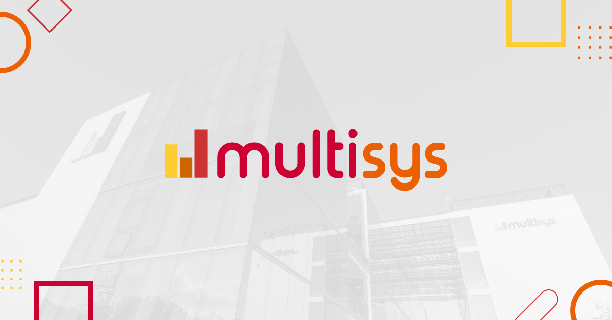

# Final Project: Todo List with Sub Todos and Authentication

Welcome to my Final Project repository! This project was created during our time at Multisys as an OJT/Intern, aiming to demonstrate our understanding of Laravel, migrations, seeders, and JWT authentication while adhering to the SOLID principles.

  

## Overview
This project is a Todo List application with the ability to create sub-todos, manage tasks efficiently, and secure user authentication through JWT tokens.

## Features
- **Todo Management**: Create, update, delete todos.
- **Sub Todo Relationship**: Each todo can have multiple sub-todos.
- **User Authentication**: Secure login, logout, and registration using JWT authentication.
- **SOLID Principle**: The codebase is designed following the SOLID principles for better maintainability and extensibility.

## Technologies Used
- **Laravel**: A powerful PHP framework for building web applications.
- **JWT Auth**: JSON Web Tokens for user authentication.
- **MySQL**: Database management system for storing todo and user data.

## Setup Instructions
1. Clone the repository: `git clone https://github.com/your-username/todolist.git`
2. Navigate to the project directory: `cd todolist`
3. Install dependencies: `composer install`
4. Set up environment variables by copying the `.env.example` file to `.env`: `cp .env.example .env`
5. Generate an application key: `php artisan key:generate`
6. Set up your database credentials in the `.env` file.
7. Run migrations to create the necessary tables: `php artisan migrate`
8. Seed the database with sample data: `php artisan db:seed --class=UsersTableSeeder`, `php artisan db:seed --class=TodoSeeder`, `php artisan db:seed --class=SubtodoSeeder`.
9. Start the development server: `php artisan serve`

## Download

## Credits
This project was created by [Zyril Evangelista](https://www.facebook.com/zyril.evangelista.9) during their time as an Intern at Multisys.

## License
This project is licensed under the [MIT License](LICENSE). Feel free to use, modify, and distribute it as per the license terms.
